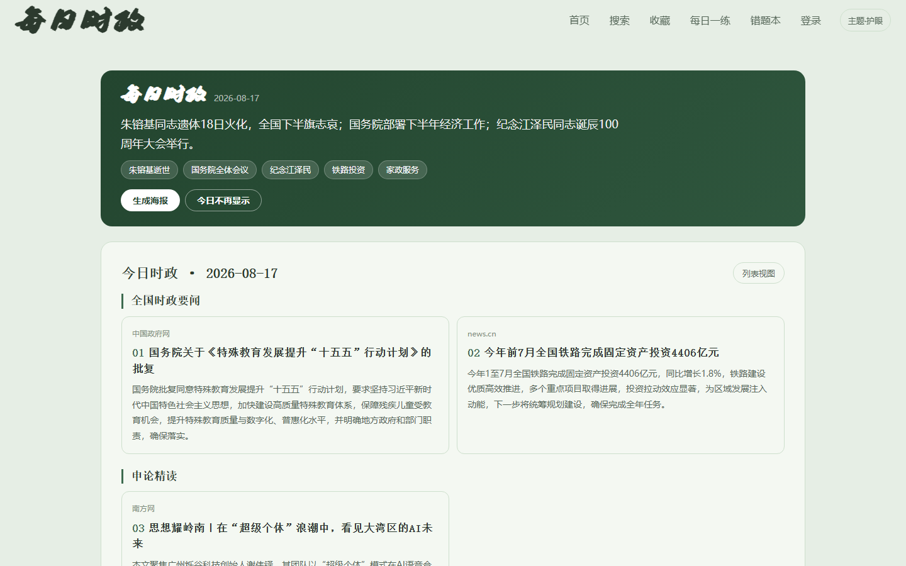
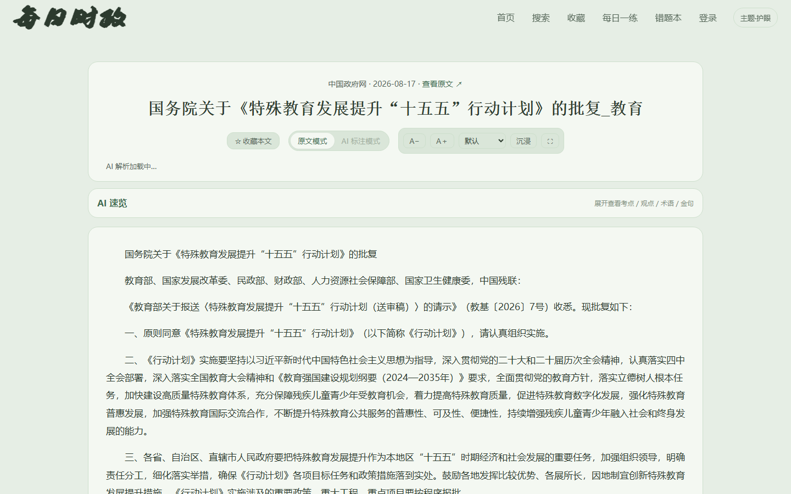
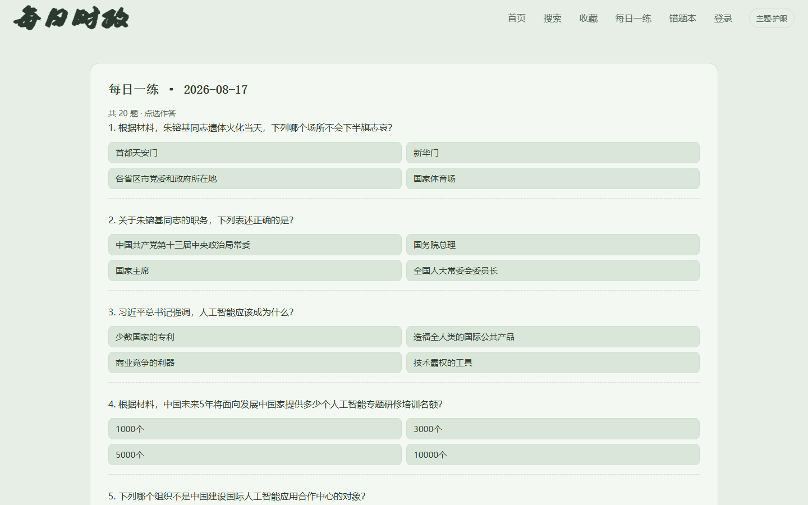
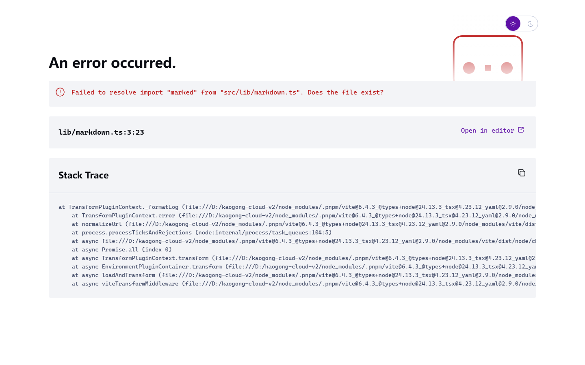
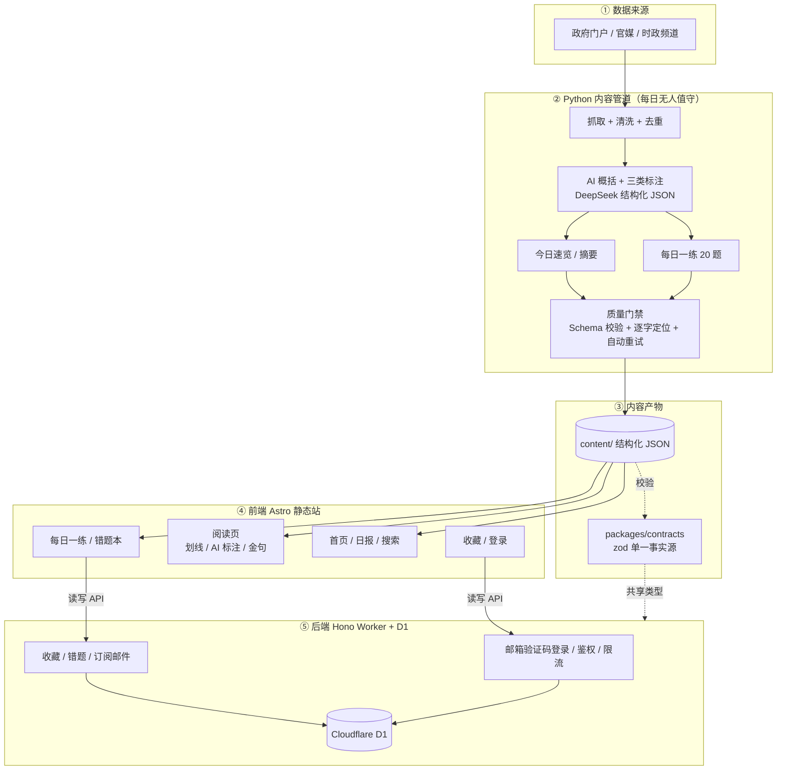

# 每日时政 · kaogong-daily

[](LICENSE)
[](https://www.meirishizheng.cn)

面向公务员 / 事业单位 / 申论考生的**时政 AI 阅读站**：每天聚合官方时政源，用 AI 概括、标注考点、自动出题，省去考生每天筛选时政材料的时间。

- **在线 Demo**：<https://www.meirishizheng.cn>

## 特性

- 🤖 **AI 概括**：每篇生成 80–120 字摘要，首页卡片快速判断值不值得读。
- 🎯 **AI 自动标注**：原文上自动标出**考点 / 观点 / 政策术语**（三色高亮 + 悬停释义），支持原文 / AI 标注模式切换。
- 💬 **AI 解析**：选中任意句子实时解释（登录不限次；未登录用邀请码共享配额，D1 原子扣减）。
- ✍️ **划线笔记**：荧光笔 / 下划线 / 加粗，存本地、免登录。
- 📝 **每日一练**：每天基于当日时政自动出 20 题 + 错题本。
- 📰 **今日速览**：首页一句话 + 关键词 + 可分享海报。
- 🧐 **审核 Agent**：把人工逐篇审核升级为 Agent 工作流（5 维评分 → 自动改写 / 删除 / 补跑 → 质量门禁验证 → 可审计报告 + 一键回退）。
- 👁 **护眼主题**：默认豆沙绿护眼主题，多主题一键切换。
- 🔒 **内容可信**：17 个官方源（人民网 / 新华网 / 中国政府网 / 求是网 / 半月谈 / 南方网等），附原文链接，AI 不改写原文。

## 截图

| 首页（今日速览 + 文章卡片） | 阅读页 · AI 标注模式（考点 / 观点 / 术语三色标注） |
|---|---|
|  |  |

| 每日一练（每日 20 题） | 阅读页（南方时评示例） |
|---|---|
|  |  |

## 技术栈

| 层 | 选型 |
|---|---|
| 前端 | Astro + TypeScript（静态站） |
| 后端 | Cloudflare Worker：Hono + Drizzle ORM |
| 数据库 | Cloudflare D1（SQLite） |
| 内容管道 | Python（抓取 / 清洗 / 去重 / AI 概括 / 出题 / 质量门禁） |
| 契约 | `packages/contracts`（zod 单一事实源，前后端共享） |
| AI | DeepSeek（结构化 JSON 输出 + 原文逐字校验 + 自动重试） |
| 部署 | Cloudflare Pages / Workers + D1 |

## 快速开始

前置：Node ≥ 22 + pnpm、Python ≥ 3.12。

```sh
pnpm install

# 1) 后端配置：复制示例并填入你自己的 D1 数据库 id
cp apps/api/wrangler.toml.example apps/api/wrangler.toml   # Windows: copy
cd apps/api && npx wrangler d1 create kaogong-db           # 创建 D1，回填 database_id
npx wrangler d1 migrations apply kaogong-db --local        # 应用迁移

# 2) 起后端（默认 8787）与前端（默认 4321）
cd apps/api && npx wrangler dev
cd apps/web && PUBLIC_API_BASE=http://127.0.0.1:8787 npx astro dev
```

打开 <http://localhost:4321>（仓库自带 `content/2026-08-17/` 示例内容，开箱即见效果）。

### 内容管道（Python）

```sh
cd pipeline
python -m venv .venv && .venv/Scripts/python -m pip install -e ".[dev]"   # Windows
.venv/Scripts/python -m kaogong 2026-08-18    # 抓取并写 content/{date}/digest.json（需 DEEPSEEK_API_KEY）
```

### 审核台（本地一键）

```sh
# Windows：双击 启动审核.bat；或
cd pipeline && .venv/Scripts/python -m kaogong.review   # http://127.0.0.1:8321
```

## 系统架构



- 静态内容走 Astro 构建产物 → Cloudflare Pages，读取零后端。
- 用户数据（收藏 / 错题 / 订阅 / 会话）只通过 Hono Worker + D1 访问。
- AI 标注是只读内容数据，与用户划线分开存储、分开渲染。

## 目录结构

```
apps/
  web/               Astro 前端
  api/               Worker 后端（Hono + Drizzle + D1）
packages/
  contracts/         zod 契约（唯一事实源）
content/
  schema/            内容 JSON Schema
  2026-08-17/        示例内容日（真实内容由管道生成，不进仓库）
pipeline/            Python 内容管道 + 审核 Agent + 审核台
docs/                product / architecture / agents / adr / deployment
.github/workflows/   CI 门禁 + 每日内容更新示例
```

## 内容质量门禁

Pipeline 输出「通过」指内容产物满足发布条件（而非脚本没抛异常）：

1. JSON 通过 `content/schema/*.json` 校验。
2. AI 概括目标 80–120 字（允许 60–150），超出自动重试或标记失败。
3. AI 标注类型只能是 `viewpoint` / `exam_point` / `term`。
4. 每个标注必须能在对应原文段落定位，`start/end` 有效、不可跨段。
5. AI 生成失败时文章仍可发布原文，但必须写入 `aiStatus` 和失败原因。
6. 内容源失败、条目异常减少或 Schema 校验失败时，流水线给出非成功质量状态，不静默发布。

## 审核 Agent（内容审核工作流）

```text
抓取 → 🤖 AI 审核（判）→ 应用审核结果（改 + 补跑 AI + 门禁验证）→ 回退（可选）→ 发布
```

- **判**：`pipeline/src/kaogong/review_agent.py` 的 `judge_item` 按 5 维黄金标准（相关性 / 标题 / 摘要 / AI 标注质量 / 原文完整）打分，给出 `keep / rewrite / drop / rerun` 决策 + 理由。判定标准见 `docs/product/review-judging-rubric.md`。
- **改**：`apply_decisions` 改写标题 / 摘要、移除噪声、补跑失败 AI，改前自动备份 `.bak` 供一键回退。
- **验**：应用后跑质量门禁返回最终状态。
- **红线**：不确定的条目标记待人工，绝不静默删除；发布由人工确认。

## 本地验证（门禁）

```sh
pnpm -r typecheck && pnpm -r test && pnpm -r build   # 前端 + 后端 + 契约
cd pipeline && python -m pytest -q                   # 内容管道
```

## 部署

见 `docs/deployment.md`（建 D1 → 迁移 → 部署 Worker → 部署 Pages）。`apps/api/wrangler.toml.example` 为配置模板。

## 版权与字体声明

- 仓库**不包含真实抓取内容**（`content/20*/` 已 gitignore），仅保留示例日 `content/2026-08-17/`；抓取内容版权归原作者 / 媒体，仅作示例。
- 站内自定义字体为**商用字体**，需自备授权（见 `apps/web/public/fonts/README.md`）；缺失时自动回退系统字体。

## License

[MIT](LICENSE)
